science art
================
2024-01-25

# Ty’s art opinion

In the context of the ongoing discussions for the redesign of our ESIIL
office space, I would like to offer my personal perspective on the art
and aesthetic that might enrich our environment:

**Urban Realism with a Personal Touch**: I have a strong appreciation
for artworks that reflect a realistic depiction of nature and urban life
but with an imaginative twist. Art that integrates with and elevates our
daily surroundings could offer a fresh perspective on the mundane.

**Nature in the Workplace**: On a personal note, I find that art which
brings elements of the outdoors inside can create a serene and
motivating atmosphere, conducive to the values of sustainability that
ESIIL embodies.

**Interactive Art**: I believe that art installations which invite
interaction or present a playful exaggeration of reality can energize
our space. They have the potential to foster a creative dialogue among
the team and with visitors.

**Dimensionality and Engagement**: From my viewpoint, art that breaks
out of the traditional two-dimensional space and engages with the viewer
in three dimensions can transform the feel of an office. Such dynamic
pieces could encourage innovative thinking and collaboration.

**Art with a Message**: It’s my opinion that the art we choose should
subtly reflect our collective social and environmental commitments.
Pieces that prompt introspection about our role in larger societal
issues could resonate well with our team’s ethos.

**Community Connection**: Lastly, I feel that our office should not just
be a place for work but also a space that invites community interaction.
Art can be a bridge between ESIIL and the public, making our office a
hub for inspiration and engagement.

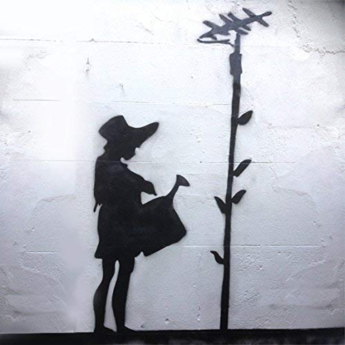

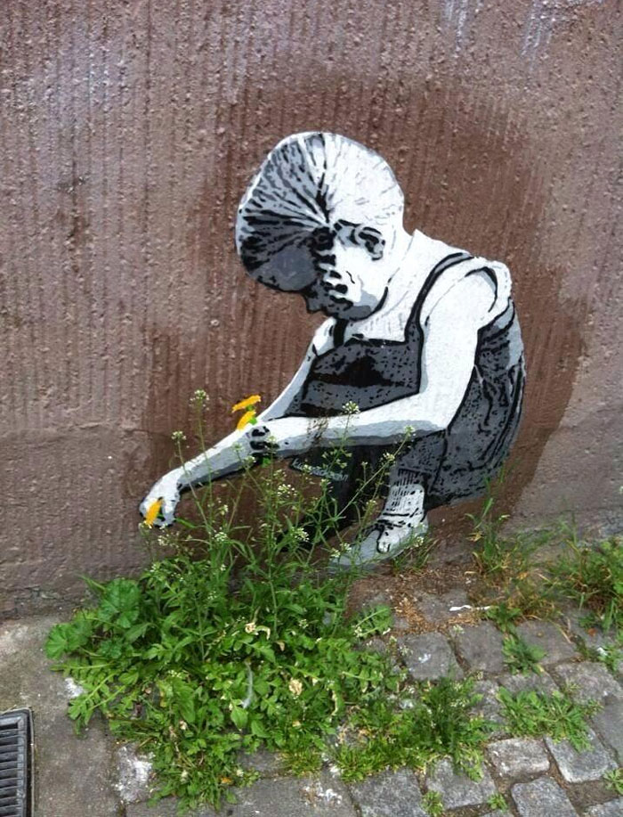

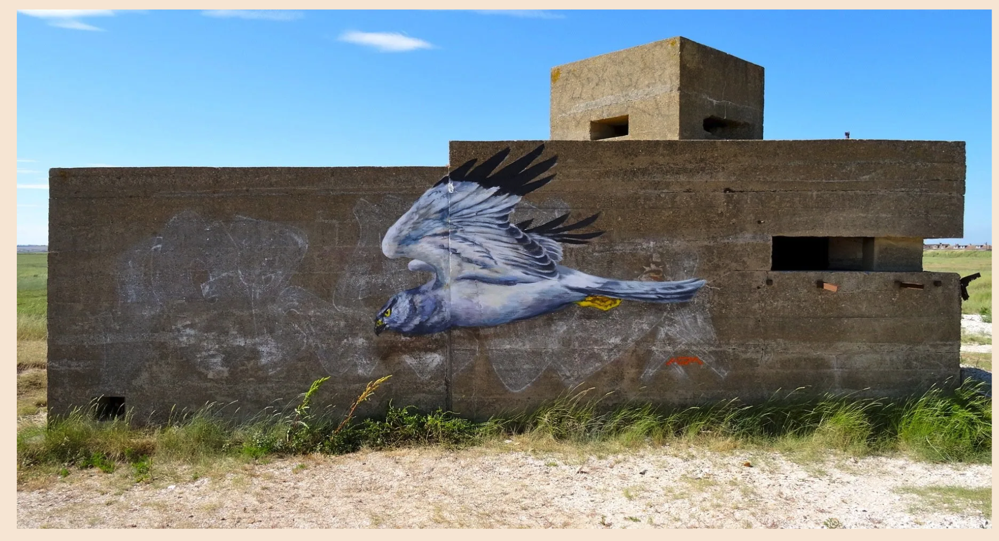
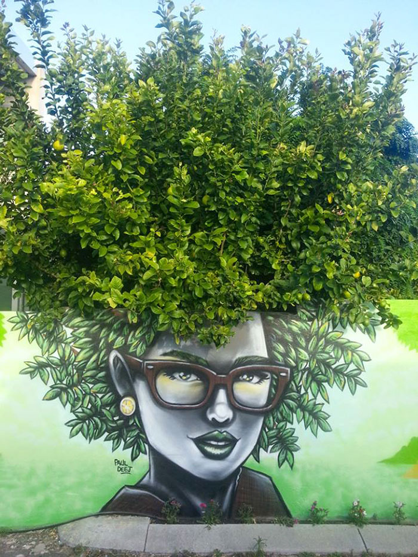
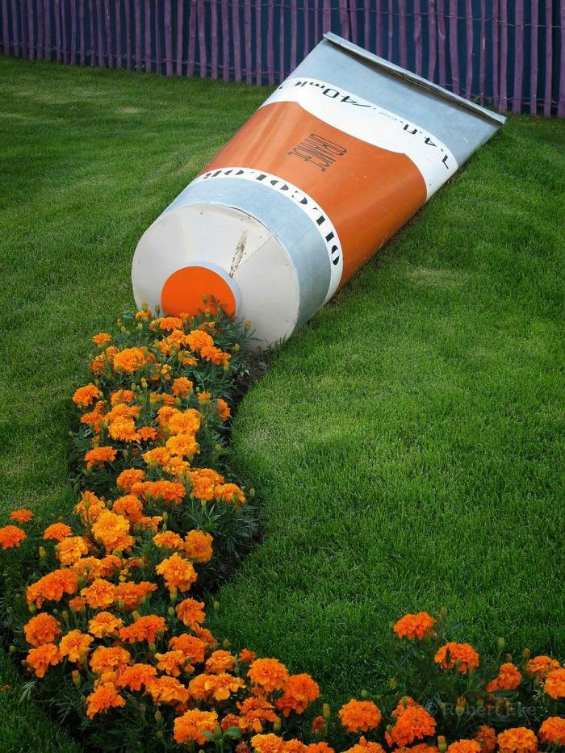

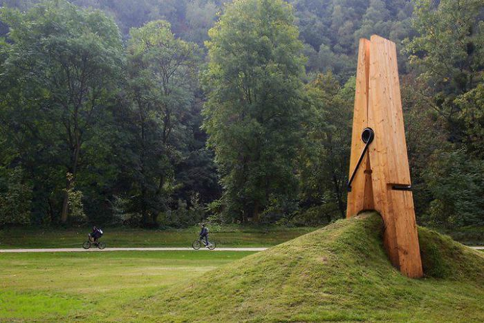
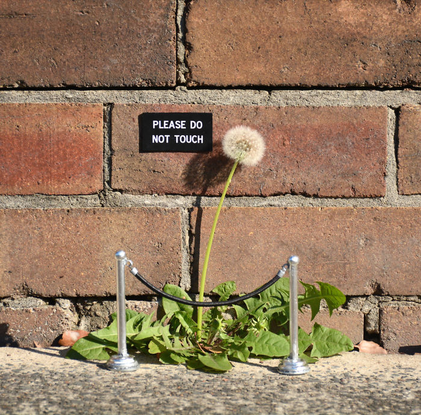
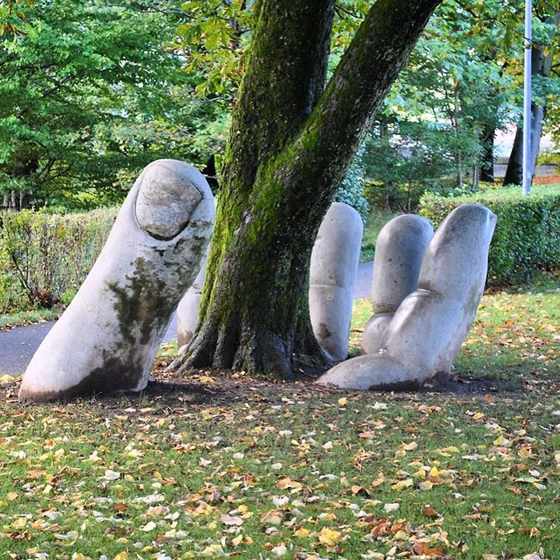
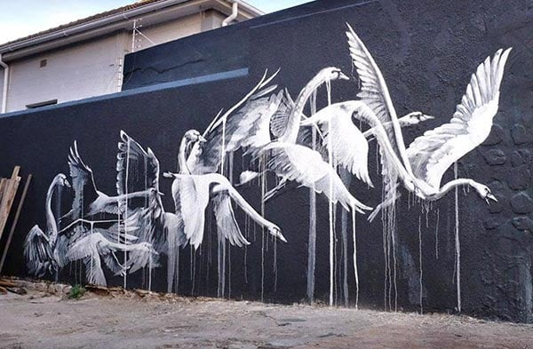 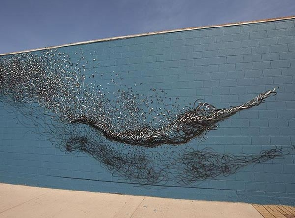
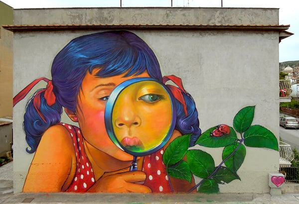
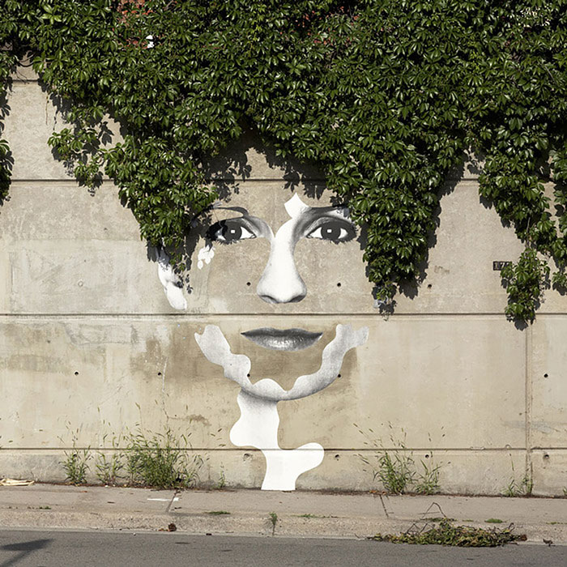
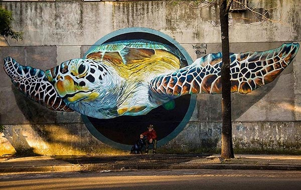
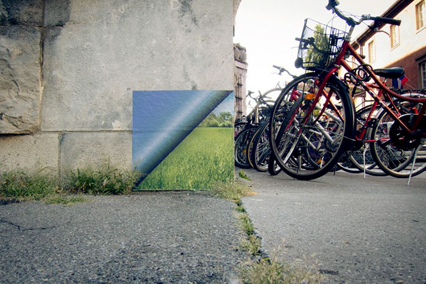
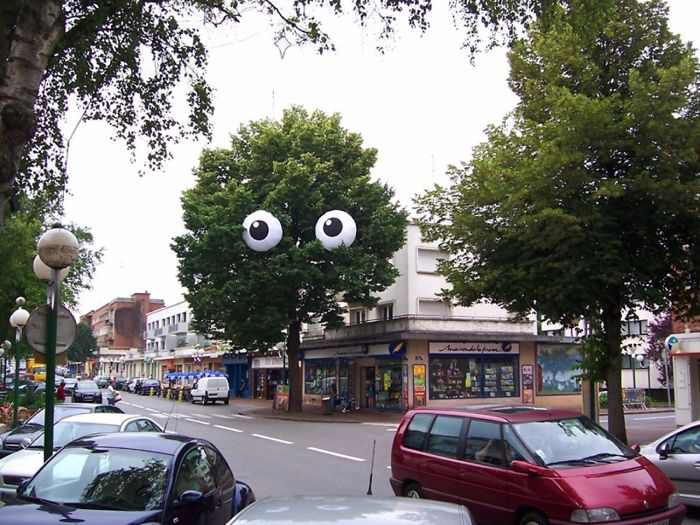
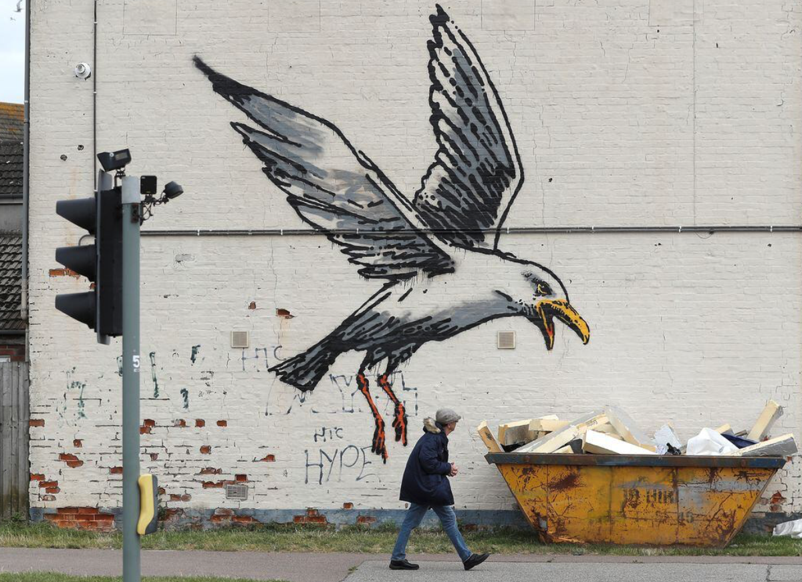
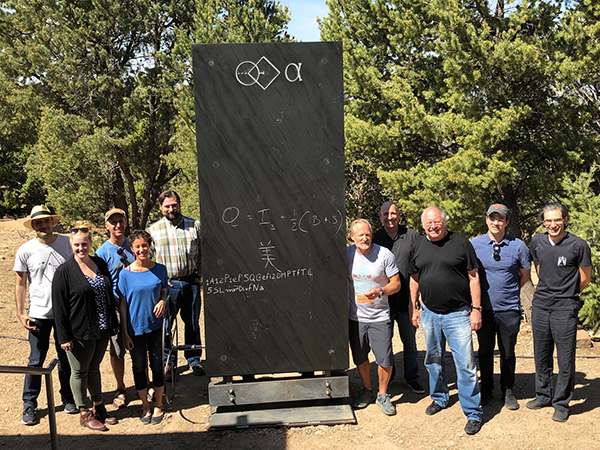
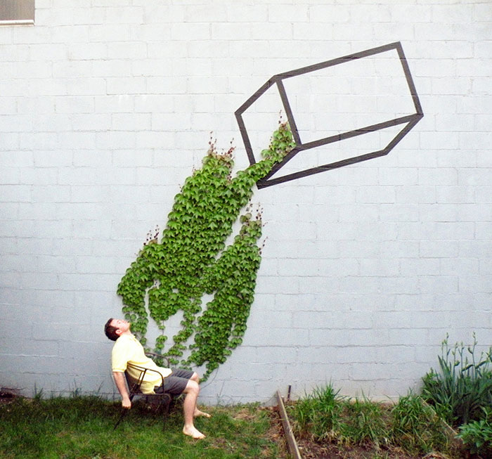
