# Connecting Cyverse to GitHub

## Log in to Cyverse

1. Go to the Cyverse user account website [https://user.cyverse.org/](https://user.cyverse.org/)

2. Click `Sign up` (if you do not already have an account)

   

3. Head over to the Cyverse Discovery Environment [https://de.cyverse.org](https://de.cyverse.org), and log in with your new account.

   

   You should now see the Discovery Environment:

   

4. We will give you permissions to access the Hackathon app. If you haven't already, let us know that you need access

## Open up an analysis with the hackathon environment (Jupyter Lab)

1. From the Cyverse Discovery Environment, click on `Apps` in the left menu
   

2. Select `JupyterLab ESIIL`
   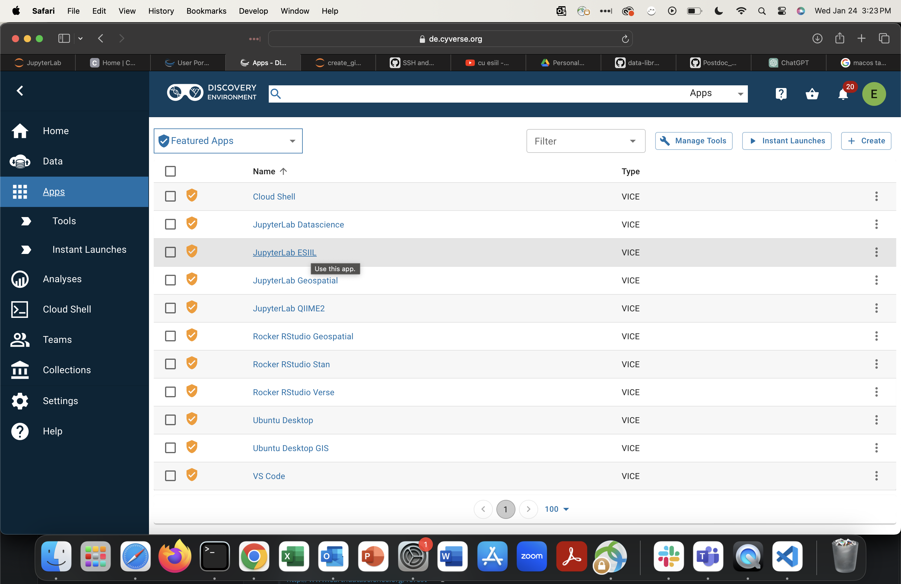

3. Configure and launch your analysis - when choosing the disk size, make sure to choose 64GB or greater. The rest of the settings you can change to suit your computing needs:
   

   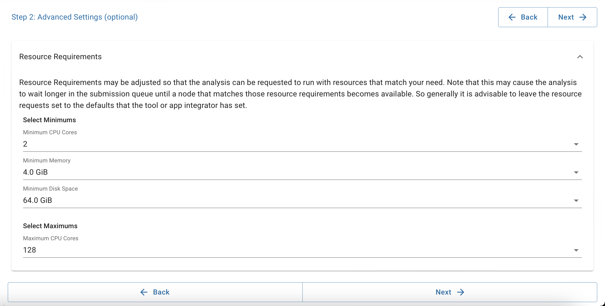

   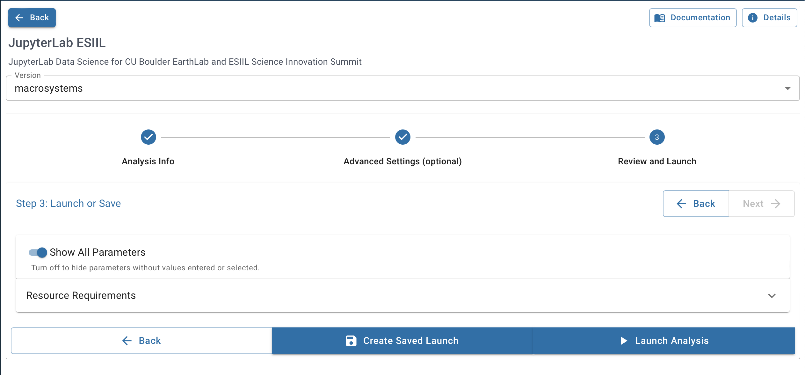

4. Click `Go to analysis`:
   

5. Now you should see Jupyter Lab!
   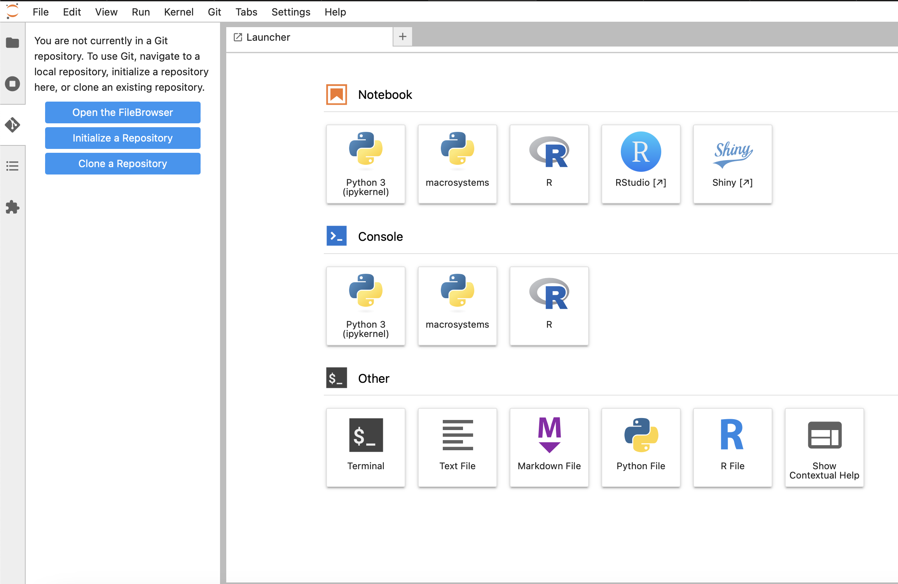

## Set up your GitHub credentials

### If you would prefer to follow a video instead of a written outline, we have prepared a video here:

1. From Jupyter Lab, click on the Git Extension icon on the left menu:
   

2. Click `Clone a Repository` and Paste the link to the cyverse-utils [https://github.com/CU-ESIIL/cyverse-utils.git](https://github.com/CU-ESIIL/cyverse-utils.git) and click `Clone`:
   
   
3. You should now see the `cyverse-utils` folder in your directory tree (provided you haven't changed directories from the default `/home/jovyan/data-store`
   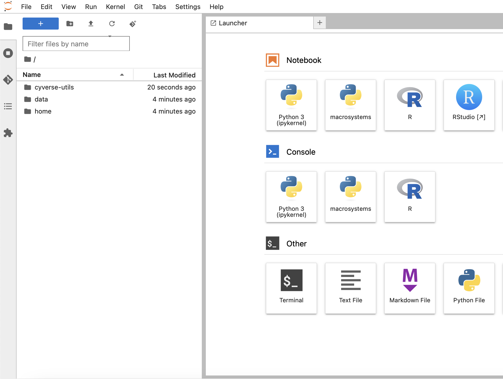

4. Go into the `cyverse-utils` folder:
   

5. open up the `create_github_keypair.ipynb` notebook if you prefer Python or the 'create_github_keypair.R' script if you prefer R by double-clicking and then select the default 'macrosystems' kernel:

6. Now you should see the notebook open. Click the `play` button at the top. You will be prompted to enter your GitHub username and email:
   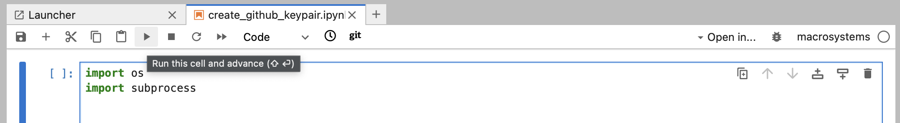

   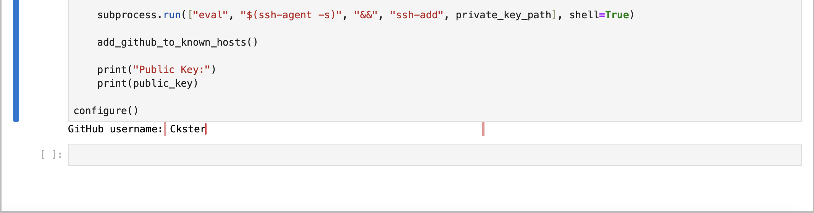

   

7. You should now see your Public Key. Copy the WHOLE LINE including `ssh-ed25519` at the beginning and the `jovyan@...` at the end

8. Go to your GitHub settings page (you may need to log in to GitHub first):
   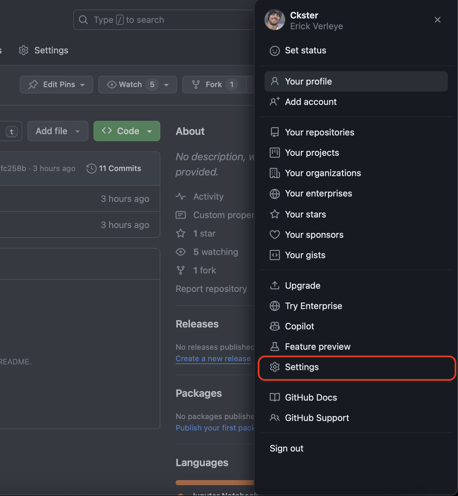

9. Select `SSH and GPG keys`
   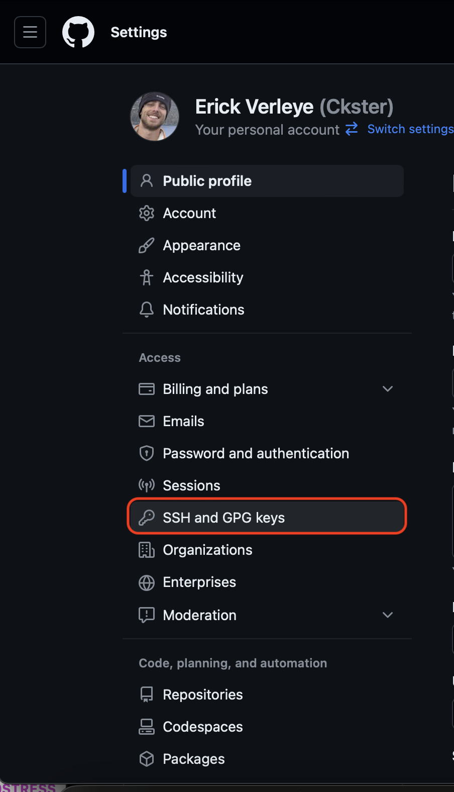

10. Select `New SSH key`
   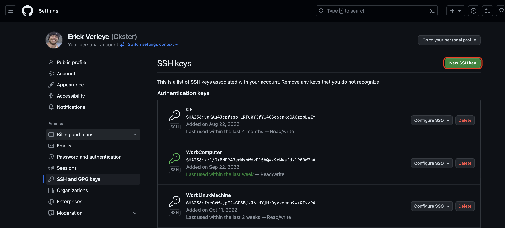

11. Give your key a descriptive name, paste your ENTIRE public key in the `Key` input box, and click `Add SSH Key`. You may need to re-authenticate with your password or two-factor authentication.:
   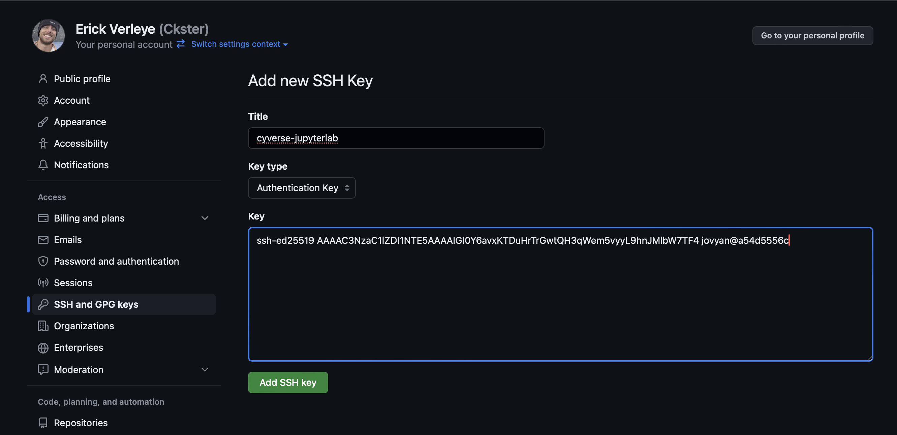

12. You should now see your new SSH key in your `Authentication Keys` list! Now you will be able to clone private repositories and push changes to GitHub from your Cyverse analysis!
   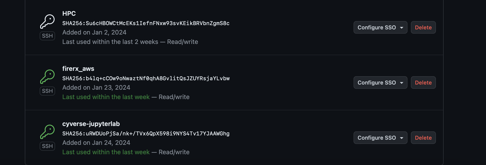

> NOTE! Your GitHub authentication is ONLY for the analysis you're working with right now. You will be able to use it as long as you want there, but once you start a new analysis you will need to go through this process again. Feel free to delete keys from old analyses that have been shut down.
