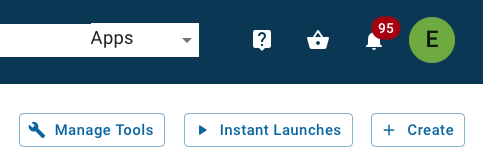
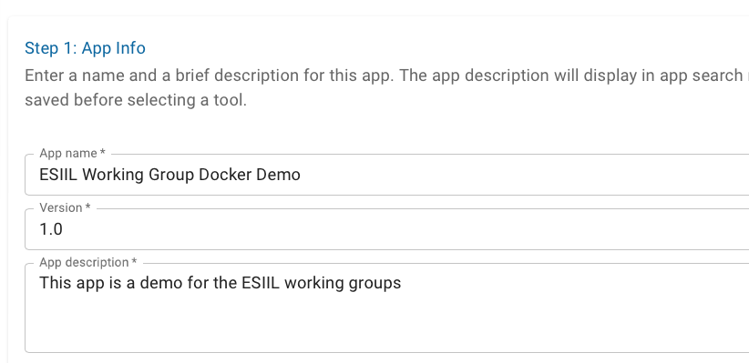

# Docker Basics

## What is Docker?

Docker is a containerization platform that enables you to package your applications along with their dependencies into self-contained units called containers.
Containers provide a consistent and portable runtime environment, making it easy to develop, test, and deploy applications across different machines.

## Key Concepts

### Images
A blueprint for a Docker container. Images are read-only and contain all the necessary code, libraries, and configurations for an application.

### Containers
A running instance of a Docker image. Containers are isolated from each other and the host system.

### Dockerfile
A text file that defines the instructions needed to build a Docker image.

## Building a jupyterlab Docker Image using GitHub Actions

### Create a Dockerfile
Create a new directory and Dockerfile within the project docker directory. Since this will be jupyterlab image, we will call the directory jupyterlab.
```bash
FROM jupyter/r-notebook:hub-4.0.1 

USER root

# Set up package manager
RUN apt-get install -y apt-transport-https && \
    apt-get clean && apt-get update && apt-get install -y software-properties-common && \
    add-apt-repository multiverse && \
    apt-get clean && rm -rf /var/lib/apt/lists/*

# Install some base software
RUN apt-get update --yes && \
    apt-get install --yes \
    fonts-dejavu \
    unixodbc \
    unixodbc-dev \
    r-base \
    r-cran-rodbc && \
    apt-get clean && rm -rf /var/lib/apt/lists/*

# Add sudo to jovyan user
RUN apt update && \
    apt install -y sudo && \
    apt clean && \
    rm -rf /var/lib/apt/lists/*
    
# This is where we can control which root permissions the jovyan user will have
ARG PRIV_CMDS='/bin/ch*,/bin/cat,/bin/gunzip,/bin/tar,/bin/mkdir,/bin/ps,/bin/mv,/bin/cp,/usr/bin/apt*,/usr/bin/pip*,/bin/yum,/opt,/opt/conda/bin/*,/usr/bin/*'

RUN usermod -aG sudo jovyan && \
    echo "$LOCAL_USER ALL=NOPASSWD: $PRIV_CMDS" >> /etc/sudoers
RUN addgroup jovyan
RUN usermod -aG jovyan jovyan

# Install RStudio
RUN apt-get update && apt-get install --yes gdebi-core && \
    wget https://download2.rstudio.org/server/jammy/amd64/rstudio-server-2023.09.1-494-amd64.deb && \
    gdebi -n rstudio-server-2023.09.1-494-amd64.deb && \
    rm rstudio-server-2023.09.1-494-amd64.deb && \
    apt-get clean && rm -rf /var/lib/apt/lists/*

# Install Geospatial libraries
RUN apt-get update && \
    apt install -y \
    gdal-bin \
    lbzip2 \
    libfftw3-dev \
    libgdal-dev \
    libgeos-dev \
    libgsl0-dev \
    libgl1-mesa-dev \
    libglu1-mesa-dev \
    libhdf4-alt-dev \
    libhdf5-dev \
    libjq-dev \
    libpq-dev \
    libproj-dev \
    libprotobuf-dev \
    libnetcdf-dev \
    libsqlite3-dev \
    libudunits2-dev \
    lsb-release \
    netcdf-bin \
    postgis \
    protobuf-compiler \
    sqlite3 \
    tk-dev \
    libfmt-dev \
    unixodbc-dev && \
    apt-get clean && rm -rf /var/lib/apt/lists/*

# Fix RStudio / Conda openssl version mismatch
RUN wget https://www.openssl.org/source/openssl-3.2.0.tar.gz && \
    tar xfz openssl-3.2.0.tar.gz && \
    mkdir openssl-build && cd openssl-build && \
    ../openssl-3.2.0/Configure --libdir=/lib/x86_64-linux-gnu/ && \
    make && \
    make install

# Update permissions for /opt/conda
RUN mkdir /usr/local/bin/start-notebook.d && \
    chown -R jovyan:users /opt/conda/share /usr/local/share /usr/local/bin/start-notebook.d 

USER jovyan

# Install jupyterlab and rstudio dependencies
RUN conda install -c conda-forge \ 
    jupyter_client \ 
    jupyter_core \ 
    jupyterlab_server \ 
    jupyter_server \
    r-rgl \
    r-htmlwidgets \
    r-htmltools && \ 
    jupyter lab clean

# reinstall R packages. Here is where you add any new R packages you would like to install 
RUN mamba install --quiet --yes \
    r-base \
    r-tidyverse \
    r-terra \
    r-future \
    r-future.apply \
    r-furrr \
    && \ 
    mamba clean --all -f -y

# Install Jupyter Lab Proxy extensions (cards in Launcher)
RUN pip install jupyter-rsession-proxy jupyter-server-proxy jupyter-shiny-proxy jupyterlab-git 

# Install Mamba Gator package manager
RUN rm -f ~/.jupyter/lab/workspaces/default* && \
    mamba install -y -c conda-forge mamba_gator

# Install and configure jupyter lab 
COPY jupyter_notebook_config.json /opt/conda/etc/jupyter/jupyter_notebook_config.json

# Rebuild the Jupyter Lab with new tools
RUN jupyter lab build

# Build Conda environment. Any packages you would like to install with conda need to be added to the environment.yml file in this Dockerfiles directory
RUN conda update -y conda && \
    conda config --remove channels conda-forge && \
    conda config --add channels conda-forge
WORKDIR /home/jovyan
COPY environment.yml /home/jovyan/ 
RUN mamba env create -f /home/jovyan/environment.yml
RUN . /opt/conda/etc/profile.d/conda.sh && conda deactivate && conda activate custom && python -m ipykernel install --name custom && pip install jupyter_contrib_nbextensions

# Install R packages from CRAN and GitHub
RUN R -e "remotes::install_github('tomroh/ecoregions')"
RUN R -e "install.packages('mblm', repos='http://cran.rstudio.com/')"

# Set any required environment variables 
ENV PROJ_LIB=/opt/conda/envs/custom/share/proj
RUN echo "PROJ_LIB=/opt/conda/envs/custom/share/proj" > /home/jovyan/.Renviron
```
There are many things going on in the Dockerfile above. Most of the lines, however, are just Linux commands you would run from a terminal when provisioning a new VM. Each block of code is commented with what it accomplishes.

### Add any necessary files
The Dockerfile above uses a file called environment.yml to provision the its conda environment and a jupyter_config_notebook.json file to configure the jupyterlab server. Both of these files will need to be added to the docker/jupyterlab directory at the same level as the Dockerfile. You can view the content of these files in this repository.

### Create the GitHub actions workflow file
Workflow files specify when and how code is executed in a GitHub Actions workflow. Actions can be triggered automatically, such as when a commit is pushed to a repo or a specific file, or they can be triggered manually. The following workflow is defined so that the Action is triggered manually. Actions can also be run on different VM types. The following Action will be run on the latest Ubuntu image. 

```bash
name: build-and-push-jupyterlab-image

on:
  workflow_dispatch:  # This allows you to manually trigger the action from GitHub UI.

jobs:
  
  build:
    runs-on: ubuntu-latest
    
    steps:
    
      - name: Checkout
        uses: actions/checkout@v3.5.0
      
      - name: Set up Docker Buildx
        id: buildx
        uses: docker/setup-buildx-action@v2.5.0
            
      - name: Login to dockerhub 
        uses: docker/login-action@v2.1.0
        with:
          username: ${{ secrets.DOCKERHUB_USERNAME }}
          password: ${{ secrets.DOCKERHUB_PASSWORD }}

      - name: Get lowercase repo name (for dynamic tags)
        id: repo_name  
        run: |
          lowercase_name=$(echo ${{ github.event.repository.name }} | tr '[:upper:]' '[:lower:]')
          echo "::set-output name=repo_name::${lowercase_name}"
        
      - name: Build and push latest
        id: docker_build_jupyterlab
        uses: docker/build-push-action@v4.0.0
        with:
          context: docker/jupyterlab
          file: docker/jupyterlab/Dockerfile
          builder: ${{ steps.buildx.outputs.name }}
          push: true
          tags: |
            esiil/${{ steps.repo_name.outputs.repo_name }}_jupyterlab:latest
     
      - name: Image digest
        run: echo ${{ steps.docker_build.outputs.digest }}
```

The steps section of the file defines what will be run by the Action. An overview of the steps of this file is as follows: Checkout the repository code, setup Docker buildx, login to DockerHub, resolve the name of the current GitHub reposiroy, build and push the Docker Image to DockerHub.

### Running the Action
From your repositories GitHub page, click on the Actions tab 


Find the workflow in the Workflow navigation menu and click on it


Click on the run workflow dropdown and click Run Workflow


## Deploying the Image on CyVerse
First go to de.cyverse.org and login. From there go to the Apps dashboard and click on Manage Tools.



### Adding the Image as a Tool
Then click Add Tool.


Give the Tool a descriptive name and set the initial version. The version can be whatever you like but 1.0 makes the most sense.


Set the Image Name to esiil/name_of_your_image and the tag to whichever tag you would like the Tool to use. Most Tools will use the latest tag.


You can see all of this information on the ESIIL dockerhub page.


Leave the Entrypoint blank, and set the working directory to /home/jovyan/data-store and the UID to 1000. Add container port 8888. This will mount and give you access to the cyverse data store. Because the file explorer GUI will not let you go above the working directory that is set, you will have to use the terminal to go up one directory and copy over any files you included in your container.


Leave all of the restrictions blank and then save the Tool


### Associating the Tool with an App
Go back to the Apps dashboard and click create


Just like for the Tool, give a descriptive name and description



For "Tool used" click select and then search for the name of the tool that was just added and then click on its row and then select at the bottom.


From the app creation screen click Next, and then click next through the next steps until you get to completion. From there click Save and Launch


From there you can go through the deployment of your app like you would deploy any other app on CyVerse and test it out.

