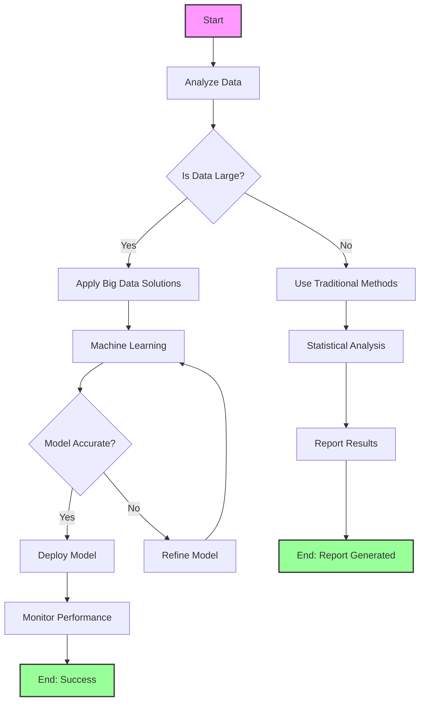
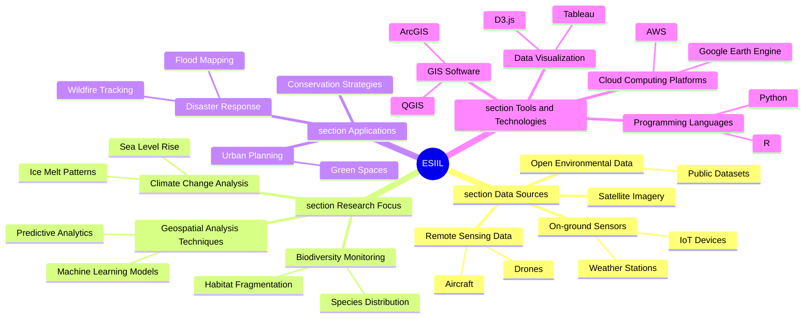
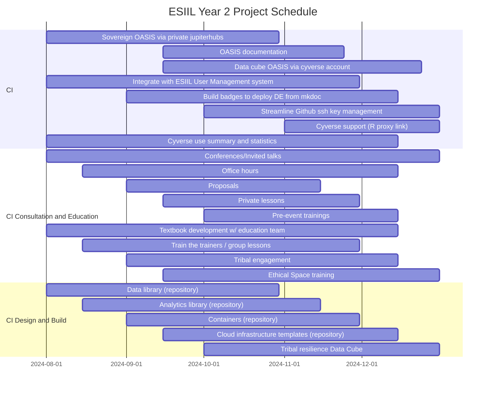
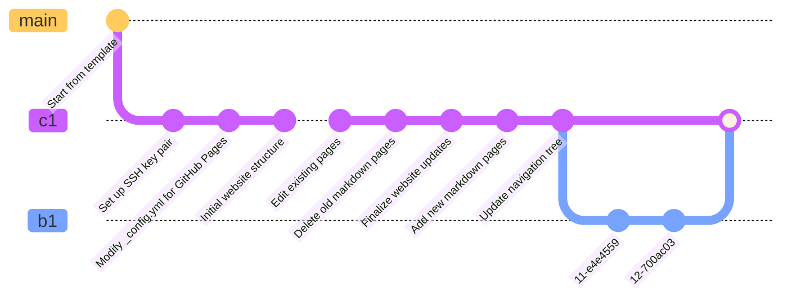
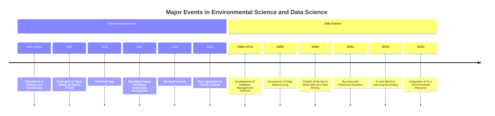
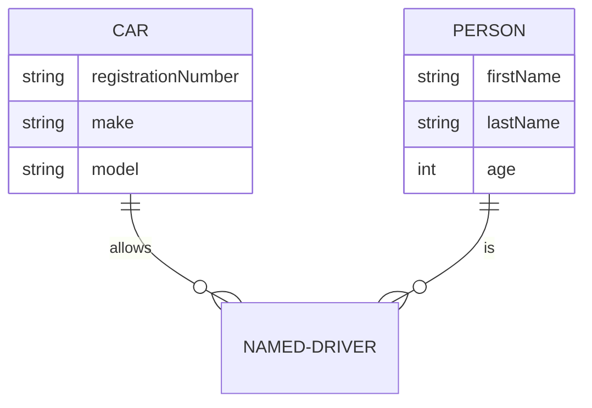
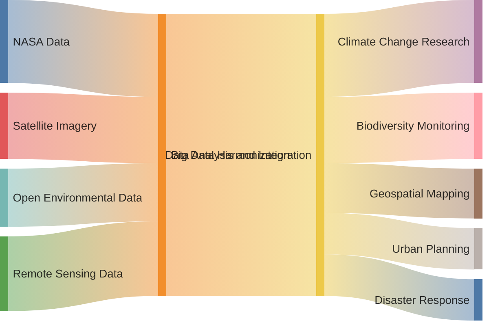

# Markdown for the Modern Researcher at ESIIL

## Introduction

- Overview of Markdown's relevance and utility in modern research.
- How Markdown streamlines documentation in diverse scientific and coding environments.

## Section 1: Mastering Markdown Syntax

- **Objective:** Equip researchers with a thorough understanding of Markdown syntax and its diverse applications.
- **Topics Covered:**
  - Fundamentals of Text Formatting (headings, lists, bold, italics)
  - Advanced Structures (tables, blockquotes)
  - Integrating Multimedia (image and video links)
  - Diagrams with Mermaid (creating flowcharts, mind maps, timelines)
  - Interactive Elements (hyperlinks, embedding interactive content)
- **Activities:**
  - Crafting a Markdown document with various formatting elements.
  - Developing diagrams using Mermaid for research presentations.
  - Embedding multimedia elements in a Markdown document for enhanced communication.

## Section 2: Markdown in Research Tools

- **Objective:** Showcase the integration of Markdown in RStudio and Jupyter Notebooks for scientific documentation.
- **Topics Covered:**
  - Implementing Markdown in RStudio (R Markdown, knitting to HTML/PDF)
  - Utilizing Markdown in Jupyter Notebooks (code and Markdown cells)
  - Best practices for documenting research code
  - Including code outputs and visualizations in documentation
- **Activities:**
  - Creating and sharing an R Markdown document with annotated research data.
  - Building a comprehensive Jupyter Notebook with integrated Markdown annotations.

## Section 3: Disseminating Research with Markdown and GitHub Pages

- **Objective:** Teach researchers how to publish and manage Markdown-based documentation as web pages.
- **Topics Covered:**
  - Setting up a GitHub repository for hosting documentation
  - Transforming Markdown files into web-friendly formats
  - Customizing web page layouts and themes
  - Advanced features using Jekyll
  - Version control and content management for documentation
- **Activities:**
  - Publishing a research project documentation on GitHub Pages.
  - Applying custom themes and layouts to enhance online documentation.

## Conclusion

- Review of Markdown's role in enhancing research efficiency and clarity.
- Encouraging the integration of Markdown into daily research activities for improved documentation and dissemination.

## Additional Resources

- Curated list of advanced Markdown tutorials, guides for GitHub Pages, and Jekyll resources for researchers.

## Section 1: Mastering Markdown Syntax

### 1. Fundamentals of Text Formatting

- **Headings**: Use `#` for different levels of headings.
  - # Heading Level 1
  - ## Heading Level 2
  - ### Heading Level 3

- **Lists**: Bulleted lists use asterisks, numbers for ordered lists.
  - Item 1
  - Item 2
    - Subitem 2.1
    - Subitem 2.2
  - 1. First item
  - 2. Second item

- **Bold and Italics**: Use asterisks or underscores.
  - **Bold Text**
  - *Italic Text*

### 2. Advanced Structures

- **Tables**: Create tables using dashes and pipes.
  - | Header 1 | Header 2 | Header 3 |
    |----------|----------|----------|
    | Row 1    | Data     | Data     |
    | Row 2    | Data     | Data     |
  - Add a ":"" to change text justification. Here the : is added on the left for left justification.
    | Header 1 | Header 2 | Header 3 |
    |---------:|--------- |----------|
    | Row 1    | Data     | Data     |
    | Row 2    | Data     | Data     |

  - |   |   |   |   |   |   |   |   |   |   |   |   |
    |---|---|---|---|---|---|---|---|---|---|---|---|
    | A | N | A | L | Y | T | I | C | S | E | N | R |
    | E | I | N | V | I | R | O | N | M | E | N | T |
    | V | E | L | O | P | M | O | C | O | M | U | N |
    | E | G | A | G | E | L | L | A | H | C | N | E |
    | R | A | T | A | D | E | V | E | L | O | P | W |
    | E | I | T | S | I | T | N | E | I | C | S | R |
    | S | O | I | G | O | L | O | I | B | H | T | L |
    | A | H | T | L | A | E | W | E | G | N | E | L |
    | T | I | T | S | I | T | N | E | I | C | S | N |
    | I | E | E | S | R | E | H | T | O | E | N | I |
    | C | S | L | L | A | H | C | E | G | L | A | N |
    | E | G | A | L | L | E | H | C | N | E | I | C |

  - If you hit the boundaries of Markdown's capabilities, you can start to add html directly. Remember, this entire exercisse is to translate to html. 

**Sudoku Puzzle**
Fill in the blank cells with numbers from 1 to 9, such that each row, column, and 3x3 subgrid contains all the numbers from 1 to 9 without repetition.

|   |   |   |   |   |   |   |   |   |
|---|---|---|---|---|---|---|---|---|
| 5 | 3 |   |   | 7 |   |   |   |   |
| 6 |   |   | 1 | 9 | 5 |   |   |   |
|   | 9 | 8 |   |   |   |   | 6 |   |
| 8 |   |   |   | 6 |   |   |   | 3 |
| 4 |   |   | 8 |   | 3 |   |   | 1 |
| 7 |   |   |   | 2 |   |   |   | 6 |
|   | 6 |   |   |   |   | 2 | 8 |   |
|   |   |   | 4 | 1 | 9 |   |   | 5 |
|   |   |   |   | 8 |   |   | 7 | 9 |

<table>
  <tr><td style="color: blue;">5</td><td style="color: blue;">3</td><td style="color: grey;">4</td><td style="color: grey;">6</td><td style="color: blue;">7</td><td style="color: grey;">8</td><td style="color: grey;">9</td><td style="color: grey;">1</td><td style="color: grey;">2</td></tr>
  <tr><td style="color: blue;">6</td><td style="color: grey;">7</td><td style="color: grey;">2</td><td style="color: blue;">1</td><td style="color: blue;">9</td><td style="color: blue;">5</td><td style="color: grey;">3</td><td style="color: grey;">4</td><td style="color: grey;">8</td></tr>
  <tr><td style="color: grey;">1</td><td style="color: blue;">9</td><td style="color: blue;">8</td><td style="color: grey;">3</td><td style="color: grey;">4</td><td style="color: grey;">2</td><td style="color: grey;">5</td><td style="color: blue;">6</td><td style="color: grey;">7</td></tr>
  <tr><td style="color: blue;">8</td><td style="color: grey;">5</td><td style="color: grey;">9</td><td style="color: grey;">7</td><td style="color: blue;">6</td><td style="color: grey;">1</td><td style="color: grey;">4</td><td style="color: grey;">2</td><td style="color: blue;">3</td></tr>
  <tr><td style="color: blue;">4</td><td style="color: grey;">2</td><td style="color: grey;">6</td><td style="color: blue;">8</td><td style="color: grey;">5</td><td style="color: blue;">3</td><td style="color: grey;">7</td><td style="color: grey;">9</td><td style="color: blue;">1</td></tr>
  <tr><td style="color: blue;">7</td><td style="color: grey;">1</td><td style="color: grey;">3</td><td style="color: grey;">9</td><td style="color: blue;">2</td><td style="color: grey;">4</td><td style="color: grey;">8</td><td style="color: grey;">5</td><td style="color: blue;">6</td></tr>
  <tr><td style="color: grey;">9</td><td style="color: blue;">6</td><td style="color: grey;">1</td><td style="color: grey;">5</td><td style="color: grey;">3</td><td style="color: grey;">7</td><td style="color: blue;">2</td><td style="color: blue;">8</td><td style="color: grey;">4</td></tr>
  <tr><td style="color: grey;">2</td><td style="color: grey;">8</td><td style="color: grey;">7</td><td style="color: blue;">4</td><td style="color: blue;">1</td><td style="color: blue;">9</td><td style="color: grey;">6</td><td style="color: grey;">3</td><td style="color: blue;">5</td></tr>
  <tr><td style="color: grey;">3</td><td style="color: grey;">4</td><td style="color: grey;">5</td><td style="color: grey;">2</td><td style="color: blue;">8</td><td style="color: grey;">6</td><td style="color: grey;">1</td><td style="color: grey;">7</td><td style="color: blue;">9</td></tr>
</table>

- **Blockquotes**: Use `>` for blockquotes.
  - > This is a blockquote.
  - > It can span multiple lines.

### 3. Integrating Multimedia

- **Images**: Add images using the format ``.
  - 

- **Videos**: Embed videos using HTML in Markdown.
  - `<iframe width="560" height="315" src="https://www.youtube.com/embed/dQw4w9WgXcQ" frameborder="0" allowfullscreen></iframe>`

### 4. Diagrams with Mermaid

- **Flowcharts**:

- **Mind Maps**:

- **Timelines**:

```mermaid
%%{init: {"quadrantChart": {"chartWidth": 400, "chartHeight": 400}, "themeVariables": {"quadrant1TextFill": "#ff0000"} }}%%
quadrantChart
  x-axis Urgent --> Not Urgent
  y-axis Not Important --> "Important ❤"
  quadrant-1 Plan
  quadrant-2 Do
  quadrant-3 Delegate
  quadrant-4 Delete
```

### 5. Interactive Elements

- **Hyperlinks**: Use the format `[link text](URL)`.
  - [Google](https://www.google.com)
  - [Play Tetris](https://tetris.com/play-tetris)

- **Embedding Interactive Content**: Use HTML tags or specific platform embed codes.
  - `<iframe src="https://example.com/interactive-content" width="600" height="400"></iframe>`

### 6. Math Notation

Markdown can be combined with LaTeX for mathematical notation, useful in environmental data science for expressing statistical distributions, coordinate systems, and more. This requires a Markdown renderer with LaTeX support (like MathJax or KaTeX).

- **Inline Math**: Use single dollar signs for inline math expressions. Representing the normal distribution.

  Example: The probability density function of the normal distribution is given by $f(x|\mu,\sigma) = \frac{1}{\sigma\sqrt{2\pi}}e^{-\frac{1}{2}\left(\frac{x-\mu}{\sigma}\right)^2}$.`

- **Display Math**: Use double dollar signs for standalone equations.

  Example:
  $$
  f(x|\mu,\sigma) = \frac{1}{\sigma\sqrt{2\pi}}e^{-\frac{1}{2}\left(\frac{x-\mu}{\sigma}\right)^2}
  $$
  

- **Common LaTeX Elements for Environmental Data Science**:
  - **Statistical Distributions**:
    - Normal Distribution: `\frac{1}{\sigma\sqrt{2\pi}}e^{-\frac{1}{2}\left(\frac{x-\mu}{\sigma}\right)^2}` for $\frac{1}{\sigma\sqrt{2\pi}}e^{-\frac{1}{2}\left(\frac{x-\mu}{\sigma}\right)^2}$
    - Poisson Distribution: `P(k; \lambda) = \frac{\lambda^k e^{-\lambda}}{k!}` for $P(k; \lambda) = \frac{\lambda^k e^{-\lambda}}{k!}$
  - **Coordinate Systems**:
    - Spherical Coordinates: `(r, \theta, \phi)` for $(r, \theta, \phi)$
    - Cartesian Coordinates: `(x, y, z)` for $(x, y, z)$
  - **Geospatial Equations**:
    - Haversine Formula for Distance: `a = \sin^2\left(\frac{\Delta\phi}{2}\right) + \cos(\phi_1)\cos(\phi_2)\sin^2\left(\frac{\Delta\lambda}{2}\right)` for $a = \sin^2\left(\frac{\Delta\phi}{2}\right) + \cos(\phi_1)\cos(\phi_2)\sin^2\left(\frac{\Delta\lambda}{2}\right)$

Note: The rendering of these equations as formatted math will depend on your Markdown viewer's LaTeX capabilities.

### 7. Effective Citations in Markdown

## Inline Citations

- **Objective:** Learn how to use inline citations in Markdown.
- **Example Usage:**
  - Inline citation of a single work: 
    - Some text with an inline citation. [@jones:envstudy:2020]
  - Inline citation with specific page or section: 
    - More text with a specific section cited. [See @jones:envstudy:2020, §4.2]
  - Contrasting views: 
    - Discussion of a topic with a contrasting view. [Contra @smith:climatechange:2019, p. 78]

## Footnote Citations

- **Objective:** Understand how to use footnote citations in Markdown.
- **Example Usage:**
  - Citing with a footnote: 
    - Some statement in the text.[^1]
  - Multiple references to the same footnote: 
    - Another statement referring to the same source.[^1]
  - A different citation: 
    - Additional comment with a new citation.[^2]

## Creating Footnotes

- **Example Syntax:**
  - [^1]: First reference details. Example: Emma Jones, "Environmental Study," Nature Journal, May 2020, https://nature-journal.com/envstudy2020.
  - [^2]: Second reference details. Example: David Smith, "Climate Change Controversies," Science Daily, August 2019, https://sciencedaily.com/climatechange2019.

